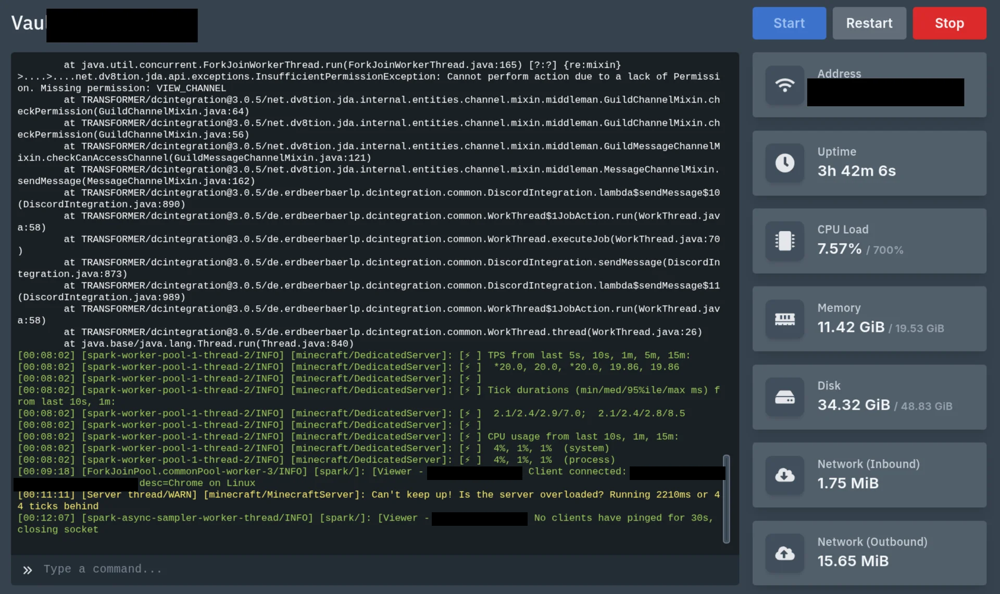

Every time one of our modded Minecraft servers crashes or starts lagging, someone on staff has to open the Pterodactyl panel and scroll through the console to figure out what happened. The answer is almost always sitting right there in `latest.log`. So I've been building Hermes, an AI agent for our network, so staff can just ask "why did the modded server crash" in Discord and get an answer.

Problem is, the same machine also runs the Pterodactyl panel, the panel's database, and every server's world files. Hermes only needs the logs, and I really don't want it anywhere near the rest.



That screenshot is what staff normally end up reading: a mod spamming stack traces, spark TPS output, and the server running 44 ticks behind. All of it lives in `latest.log`, and that's the one thing Hermes gets to see.

This post is just about the access side: how Hermes gets the logs and how it's kept away from everything else. Setting up the agent itself is for another post.

## Why Telling Hermes "Don't" Isn't Enough

Minecraft logs contain player chat, usernames, sign text and command arguments. Anyone who can join the server can put text into the file Hermes is about to read.

So putting rules in the agent's prompt doesn't cut it. Prompt rules stop an agent that's confused, not a player who's actively trying to talk it into something. The restriction has to come from the OS itself.

I went through a couple of ideas before landing on the final one:

| Approach | Problem |
|---|---|
| Block access to sensitive files | You have to list every bad file, and one you forget is one that leaks. Modded servers have hundreds of config files, and plugin configs often hold database passwords and bot tokens. |
| Mirror the `logs` folder somewhere read-only | Works, but the mirror tracks the original folder, not its name. If a modpack swap deletes and recreates `logs`, the mirror quietly keeps showing the old one and the agent reports no crashes. Also four lines of setup per server. |

What I ended up doing gives Hermes **no file access at all**. It just gets one command.

---

## 1. Create the Group and the Account

```bash
sudo groupadd mclogs
sudo useradd -r -m -d /var/lib/hermes-staff -s /bin/bash hermes-staff
```

`hermes-staff` is the account Hermes will run as. I did **not** add it to the `mclogs` group, and that's on purpose. The group is what unlocks the logs, and it only gets handed to the tool for the moment it runs, never to the account itself.

## 2. Give the Group Access to the Logs

Standard Linux permissions only allow one owner and one group per folder, and Pterodactyl already uses both. ACLs let you add an extra rule on top without disturbing that.

```bash
V=/var/lib/pterodactyl/volumes
U=<server-uuid>

sudo setfacl -m g:mclogs:x /var/lib/pterodactyl "$V" "$V/$U"
sudo setfacl -R -m g:mclogs:rX "$V/$U/logs"
sudo mkdir -p "$V/$U/crash-reports"
sudo chown --reference="$V/$U/logs" "$V/$U/crash-reports"
sudo setfacl -R -m g:mclogs:rX "$V/$U/crash-reports"
sudo setfacl -d -m g:mclogs:r "$V/$U/logs" "$V/$U/crash-reports"
```

Repeat for each server.

The trick here is the first line. On a folder, the `x` permission doesn't mean "run", it means "walk through". So the group can pass *through* the server folder to reach `logs`, but if it tries to list that folder it gets permission denied. The `mods` and `config` folders aren't just blocked, they're invisible.

The last line matters too: it makes new files inherit the access, so tomorrow's log file is readable without running any of this again.

One honest caveat: if a modpack swap ever deletes and recreates the `logs` folder itself, these ACLs go with it, which is the same trap I dinged the mirror idea for. The difference is how it fails. The mirror would quietly keep serving stale logs, while this setup just starts returning permission denied until I rerun the `setfacl` lines. I'll take a loud failure over a quiet lie.

Check it worked:

```bash
getfacl "$V/$U/logs"
```

## 3. Give the Servers Friendly Names

`/etc/mclogs.conf`:

```
modded       00000000-1111-2222-3333-444444444444
survival     55555555-6666-7777-8888-999999999999
```

Pterodactyl identifies servers by long random IDs. Nobody should have to remember those.

## 4. The Log-Reading Script

This script is all Hermes ever gets. Six read-only operations, nothing else.

`/usr/local/bin/mclogs.sh`:

```bash
#!/bin/bash
set -u
V=/var/lib/pterodactyl/volumes
CAP=150000

n=${1:-}; m=${2:-tail}; a=${3:-}
u=$(awk -v n="$n" '$1==n{print $2}' /etc/mclogs.conf)
[[ -n "$u" ]] || { echo "servers:"; awk '{print "  "$1}' /etc/mclogs.conf; exit 1; }

D=$V/$u; L=$D/logs/latest.log

case "$m" in
  tail)   [[ -f "$L" ]] || { echo "latest.log missing"; exit 1; }
          tail -n "${a:-200}" "$L" ;;
  crash)  f=$(ls -t "$D"/crash-reports/*.txt 2>/dev/null | head -1)
          [[ -n "${f:-}" ]] && head -n 150 "$f" || echo "no crash reports" ;;
  lag)    grep -E "Can't keep up|running behind|watchdog|Spark|TPS" "$L" | tail -n 80 ;;
  list)   ls -t "$D"/logs/ | head -40 ;;
  old)    [[ "$a" =~ ^[0-9.-]+\.log\.gz$ ]] || { echo "bad filename"; exit 1; }
          zcat "$D/logs/$a" 2>/dev/null | tail -n 200 || echo "no such file" ;;
  search) gz=$(ls -t "$D"/logs/*.log.gz 2>/dev/null | head -20)
          { grep -F -e "$a" "$L" 2>/dev/null
            [[ -n "$gz" ]] && zgrep -F -e "$a" $gz 2>/dev/null || true
          } | tail -n 100 ;;
  *) echo "usage: mclogs <server> [tail N|crash|lag|list|old <file>|search <term>]"; exit 1 ;;
esac | head -c "$CAP"

rc=${PIPESTATUS[0]}
[[ "$rc" == "141" ]] && rc=0   # killed by the cap, output is fine
exit "$rc"
```

```bash
sudo chown root:mclogs /usr/local/bin/mclogs.sh
sudo chmod 750 /usr/local/bin/mclogs.sh
```

A few things in there I made sure of:

- **Folder paths come from the config file, never from what's typed in.** Hermes picks a server by name; it can't hand over a path of its own.
- **`old` checks the filename first**, so something like `../../config/whatever` can't sneak through.
- **The last line cuts every answer off at 150 KB.** Minecraft keeps writing to one log file until the server restarts, and it can get very large. Without a hard limit, a single request can be too big for the AI to read and expensive to send.

> Old logs are stored compressed as `2026-07-25-3.log.gz`, the third server start on that date. Handy detail: after a crash, the crash itself is at the end of the *previous* numbered file, not the start of the new one.

## 5. The Wrapper That Hands Over the Group

The script needs to run with the `mclogs` group even though the account calling it isn't in that group. Linux has a flag for exactly this, but it ignores it on shell scripts, on purpose, because they're too easy to abuse. So a tiny compiled program goes in front.

The obvious version doesn't work:

```c
execv("/usr/local/bin/mclogs.sh", argv);   // permission denied
```

**Bash gives up the extra group as soon as it starts, unless you pass `-p`.** That's the whole fix, and I lost a good hour to it.

`/usr/local/src/mclogs-wrapper.c`:

```c
#include <unistd.h>

int main(int argc, char **argv) {
    char *args[argc + 3];
    char *env[] = { "PATH=/usr/local/bin:/usr/bin:/bin",
                    "IFS= \t\n", "LC_ALL=C", NULL };

    args[0] = "/bin/bash";
    args[1] = "-p";
    args[2] = "/usr/local/bin/mclogs.sh";
    for (int i = 1; i < argc; i++) args[i + 2] = argv[i];
    args[argc + 2] = NULL;

    execve("/bin/bash", args, env);
    return 1;
}
```

```bash
sudo gcc -o /usr/local/bin/mclogs /usr/local/src/mclogs-wrapper.c
sudo chown root:mclogs /usr/local/bin/mclogs
sudo chmod 2755 /usr/local/bin/mclogs
```

The hardcoded `env` list is there for a reason. `-p` blocks most ways of smuggling things in, but it doesn't reset `PATH`, the list of folders Linux searches for commands. The script calls `tail`, `awk` and `zcat` by name, so without this, someone could point `PATH` at their own folder and get their version to run instead.

## 6. Check It

Should work:

```bash
sudo -u hermes-staff mclogs modded list
sudo -u hermes-staff mclogs modded tail 20
```

Should all fail:

```bash
sudo -u hermes-staff ls /var/lib/pterodactyl/volumes
sudo -u hermes-staff cat "$V/$U/server.properties"
```

And this one should still *work*, even though it looks like an attack:

```bash
sudo -u hermes-staff env PATH=/tmp /usr/local/bin/mclogs modded list
```

That's the whole point of the wrapper: it throws away the caller's environment, so even if someone points `PATH` at a folder full of fake `tail` and `awk` binaries, the real ones run anyway. If this command errors out instead of listing logs, the env pinning in the wrapper isn't doing its job.

Poking around with the powerless account also turned up a completely unrelated problem: the panel's `.env` file was readable by every account on the machine, database password and app key included, and had been since install. Nobody noticed because the new account was the first thing that ever went looking.

Turns out making an account with no power and poking around with it is a pretty cheap way to audit the rest of the machine.

---

## Left Out on Purpose

**Running commands in-game.** Pterodactyl's API can send commands to a server, which would let Hermes run `/spark health` itself when someone asks about lag. But that permission is all-or-nothing, and the same access also covers `/op`, `/ban` and `/stop`. So instead, a staff member runs the command and Hermes reads the result out of the log. It costs a staff member maybe ten seconds, and I can live with that.

**Containers or a separate VM.** A VM would be a real improvement, since the panel and the game servers currently share a machine with Hermes. But once the agent is down to one read-only command and no file access, the extra isolation doesn't buy much anymore. I'll bother with it the day Hermes is allowed to change files.

---

## Key Takeaways

- **Give the agent a tool, not access.** One command with six fixed operations is way easier to reason about than a filesystem with parts removed.
- **If your plan involves listing every file to block, flip it around** and only allow what's needed.
- **Rules in a prompt are a suggestion, not a limit**, especially when anyone who joins the server can write into the input.
- **If a setgid wrapper mysteriously does nothing, try `bash -p`.** Would have saved me an hour.
- **Put a size limit on anything an AI reads.** Context limits and API bills are both real.

Now that the plumbing is done, the agent side is honestly the easy part: Hermes runs one command, reads the output, and can't touch anything else on the machine.
