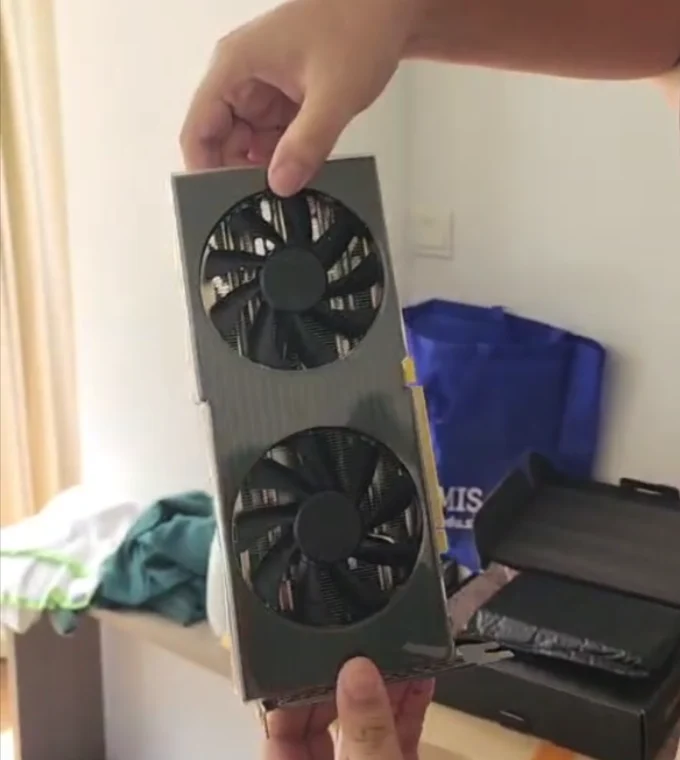
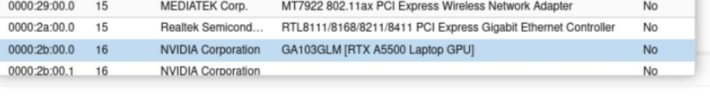
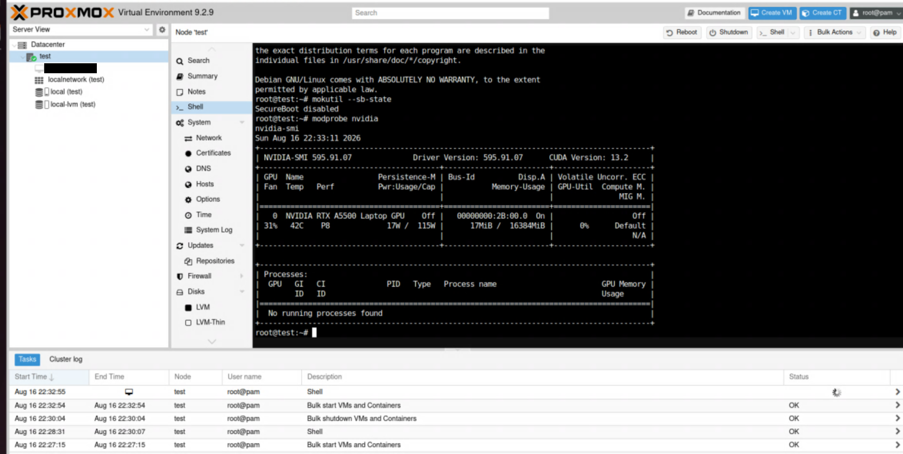
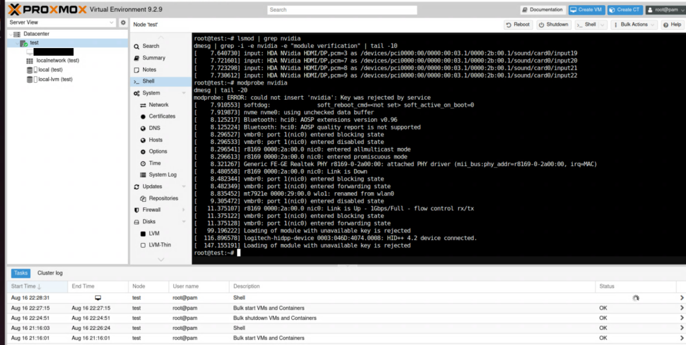
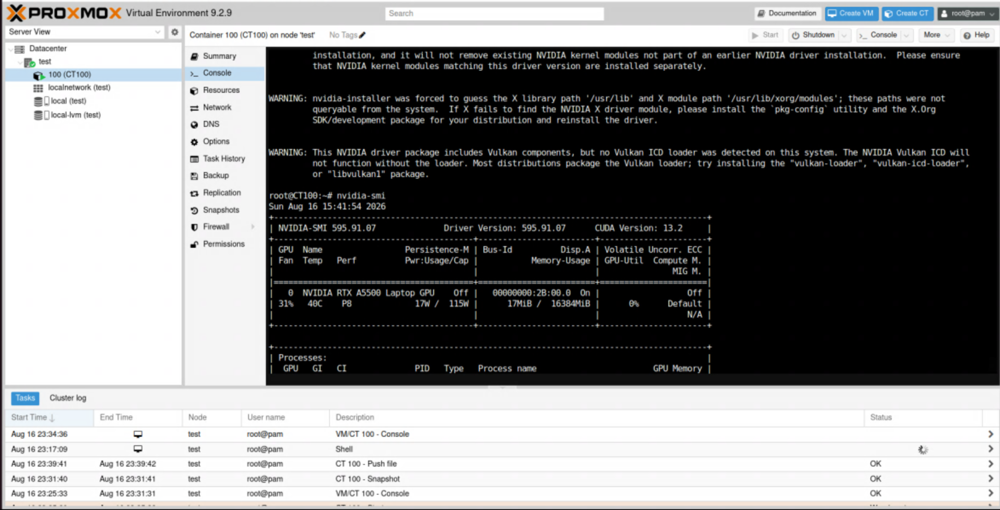
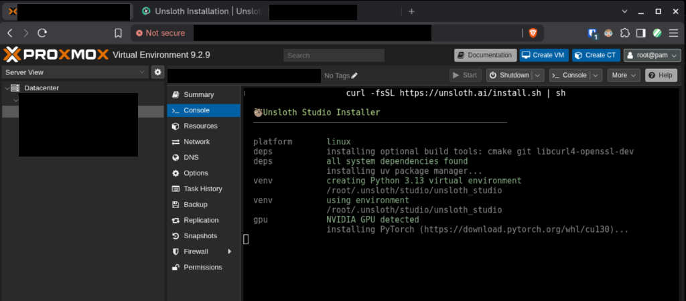
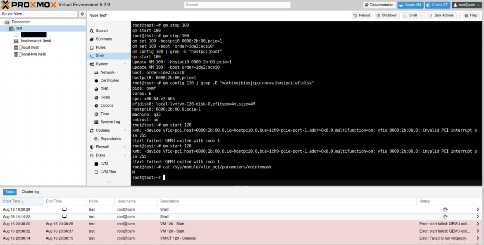

I set up an AI server on Proxmox using a laptop GPU mounted in a desktop machine. It works well,
but not the way I expected. The card can't be passed through to a virtual machine at all. It runs
in an LXC container instead.

This is the full setup, start to a working Unsloth install. There's a short note at the end on why
the VM route doesn't work.

## The card

An **NVIDIA RTX A5500 Laptop GPU**: GA103GLM, 16 GB, Ampere, compute capability 8.6. Mobile
silicon pulled from a workstation laptop and mounted on a desktop board.



Mounted on a desktop board it looks ordinary enough. Proxmox sees it fine:



Good value: roughly twice the compute of an RTX 3060 with 4 GB more VRAM, which for fine-tuning is
the difference between a 13B model being painful and being comfortable.

- Proxmox VE 9.2.9, kernel 7.0.14-8-pve
- NVIDIA driver 595.91.07, open kernel module
- Ubuntu 24.04 in a privileged LXC container
- Unsloth for training and inference

## Why a container

A container shares the host's kernel. So the driver gets installed once on the Proxmox host, and
the container borrows the device nodes. No hypervisor in the middle, which means no performance
loss and none of the passthrough complexity.

```
Proxmox host
├── NVIDIA driver + kernel module
├── /dev/nvidia0, nvidiactl, nvidia-uvm
│
└── LXC container (Ubuntu 24.04)
    ├── device nodes shared from host
    ├── NVIDIA userspace only (no kernel module)
    └── PyTorch + Unsloth
```

## Driver on the host

Two things to know first.

**Take a recent driver.** I tried 580 and it wouldn't compile because the kernel had changed a macro
that 580's source still used the old way. 595 built fine. On a new kernel, use the newest driver
rather than whatever an older guide recommends.

**Skip the distro packages.** Debian ships 550, too old here. Ubuntu's is 595.71.05, close to but
not the same as 595.91.07, and host and container versions have to match exactly or CUDA reports
a driver/library mismatch. NVIDIA's `.run` installer on both sides avoids that entirely.

```bash
apt install -y pve-headers-$(uname -r) build-essential dkms

echo -e "blacklist nouveau\noptions nouveau modeset=0" > /etc/modprobe.d/blacklist-nouveau.conf
update-initramfs -u -k all
reboot
```

After the reboot:

```bash
wget https://download.nvidia.com/XFree86/Linux-x86_64/595.91.07/NVIDIA-Linux-x86_64-595.91.07.run
chmod +x NVIDIA-Linux-x86_64-595.91.07.run
./NVIDIA-Linux-x86_64-595.91.07.run --dkms --no-x-check
```

Choose the **MIT/GPL** kernel module (the open one, correct for Ampere), no 32-bit libraries, and
**keep the private signing key**. DKMS uses it to re-sign after kernel upgrades.

Then make sure both modules load at boot:

```bash
# /etc/modules
nvidia
nvidia_uvm
```

`nvidia_uvm` is easy to miss. Without it `nvidia-smi` works fine but `torch.cuda.is_available()`
returns False.



If Secure Boot is on, the installer will offer to sign the module, but signing isn't enough, the
key also has to be enrolled through a MOK Manager screen during boot. Ten second timeout, before
the OS starts, so no SSH and no web console.



The MOK Manager screen bugged out, so we just disabled Secure Boot instead. The module stays signed;
a system that isn't enforcing ignores the signature.

## Container config

Create it **privileged**. Unprivileged containers remap user IDs, so container-root isn't real
root on the host, and the NVIDIA ioctls need real root. Set `nesting=1` too because systemd inside the
container needs it.

The GPU isn't visible by default because containers get a minimal `/dev`. Add to
`/etc/pve/lxc/<id>.conf`:

```
lxc.cgroup2.devices.allow: c 195:* rwm
lxc.cgroup2.devices.allow: c 511:* rwm
lxc.mount.entry: /dev/nvidia0 dev/nvidia0 none bind,optional,create=file
lxc.mount.entry: /dev/nvidiactl dev/nvidiactl none bind,optional,create=file
lxc.mount.entry: /dev/nvidia-uvm dev/nvidia-uvm none bind,optional,create=file
lxc.mount.entry: /dev/nvidia-uvm-tools dev/nvidia-uvm-tools none bind,optional,create=file
```

The `devices.allow` lines grant access by major number: 195 is the NVIDIA device, 511 is
nvidia-uvm. The `rwm` includes mknod, which matters: NVIDIA's device nodes are created on first
driver use rather than at module load, so after a cold boot they often don't exist yet and the
bind mounts quietly skip. The container works anyway because it creates its own nodes using that
mknod permission.

Two traps:

**The uvm major number is dynamic.** 511 today, possibly different after a host reboot. If the
container loses GPU access, check that first. Allowing 508–511 is cheap insurance.

**Put these lines at the top of the config.** Anything below a `[snapshot-name]` header belongs to
that snapshot and is ignored by the running container.

## Driver in the container

Userspace only. The container uses the host's kernel module:

```bash
# on the host
pct push 100 /root/NVIDIA-Linux-x86_64-595.91.07.run /root/NVIDIA-Linux-x86_64-595.91.07.run

# in the container
apt install -y build-essential
chmod +x /root/NVIDIA-Linux-x86_64-595.91.07.run
/root/NVIDIA-Linux-x86_64-595.91.07.run --no-kernel-module --no-x-check --silent
```

`--no-kernel-module` is the flag that makes this work. Reusing the same installer file guarantees
the versions match.



Full 16 GB, same driver as the host, and no virtualization layer means the same throughput a
bare-metal install would get.

## Unsloth

```bash
curl -fsSL https://unsloth.ai/install.sh | sh
```

It sets up its own Python environment and pulls the matching PyTorch build.



Set a password before doing anything else. Studio has no auth until you do:

```bash
unsloth studio reset-password
```

It prints a generated password. You'll be asked to change it on first login.

Studio binds to localhost by default, so to reach it from another machine:

```bash
unsloth studio -H 0.0.0.0 -p 8888
```

That serves it unauthenticated-on-the-network until you've set the password, so do that first. If
you'd rather not open a port at all, `--secure` exposes it only through a Cloudflare HTTPS tunnel
and fails closed if the tunnel can't start.

### Making it persistent

Started from a shell, Studio dies when you close the session. A systemd unit inside the container
fixes it:

```ini
# /etc/systemd/system/unsloth-studio.service
[Unit]
Description=Unsloth Studio
After=network-online.target
Wants=network-online.target

[Service]
Type=simple
WorkingDirectory=/root
ExecStart=/root/.unsloth/studio/unsloth_studio/bin/unsloth studio -H 0.0.0.0 -p 8888
Restart=on-failure
RestartSec=10

[Install]
WantedBy=multi-user.target
```

```bash
systemctl daemon-reload
systemctl enable --now unsloth-studio
```

Check `which unsloth` for the real path. It's inside the venv Unsloth creates.

## Testing that it all survives a reboot

Worth doing rather than assuming. Reboot the host, wait, then run `nvidia-smi` **inside the
container as the very first command**, before touching anything on the host.

```bash
pct exec 100 -- nvidia-smi
pct exec 100 -- ip a
curl -I http://<container-ip>:8888
```

If all three work with no manual intervention, the setup is genuinely persistent. Doing it in this
order also proves the container is creating its own device nodes rather than relying on the host
having initialised the GPU first.

Set `onboot: 1` on the container or it won't start with the host.

## What didn't work: VM passthrough

The original plan was a VM with PCIe passthrough. Not possible with this card on this board.

After correcting the obvious things (a VM needs **q35** and **OVMF**, not Proxmox's default
i440fx and SeaBIOS, which can't do PCIe at all), it still refused to start:



```
vfio 0000:2b:00.0: invalid PCI interrupt pin 255
```

Every PCI device stores an interrupt pin in its config space. Valid values are 0 to 4. This card
reports 255: `0xff`, an unwritten byte.

That field is filled in by platform firmware. In a laptop, ACPI does it. A desktop board has no
idea this is a laptop part and leaves it blank. QEMU validates it before creating the device, the
check is compiled in, and there's no flag to skip it. `vfio-pci nointxmask=1` doesn't help,
because the rejection happens in QEMU rather than the kernel driver.

Bare metal doesn't care because nothing is remapping the interrupt. The card works fine under Windows
and would work fine on bare-metal Linux. It's specifically virtualization that breaks.

If you need VM passthrough, test on your board before buying: the interrupt pin comes from
motherboard firmware, so other boards may populate it correctly. If a container is fine, the card
is a good buy. You lose kernel-level isolation and nothing else.
