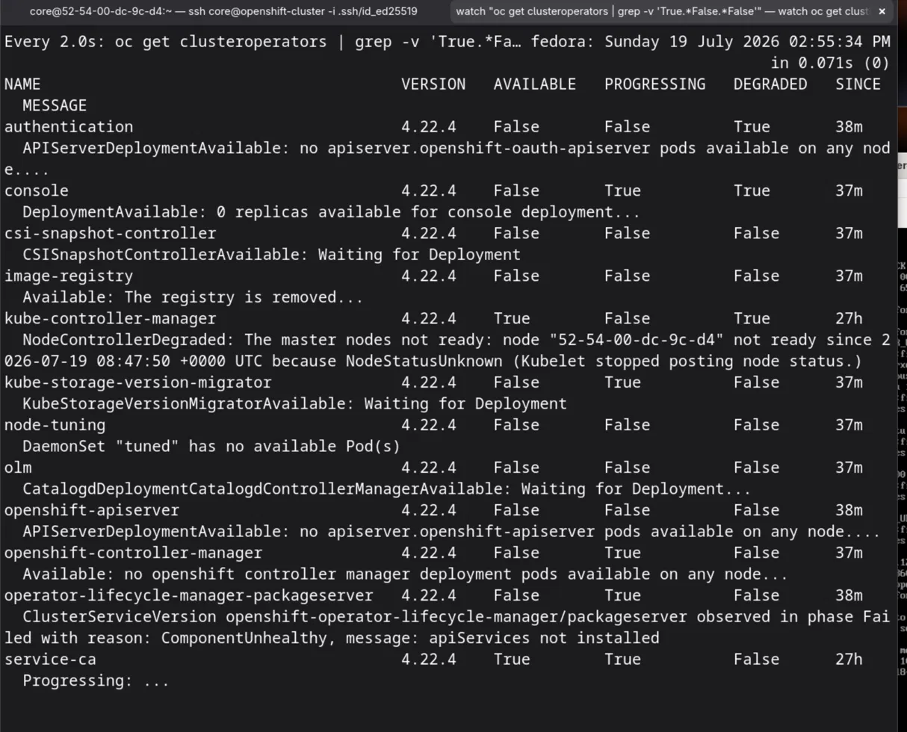

If you have set up OpenShift in a VM, especially a Single Node OpenShift (SNO) lab, there is a good chance you will run into this at some point. You shut the cluster down, come back a day or two later, and open the web console to log in. Instead of the login page, you get met with this:

```
error: server_error The authorization server encountered an unexpected condition
that prevented it from fulfilling the request.
```

That error is the single most common problem with an SNO lab: expired kubelet certificates. The short version is that OpenShift uses TLS certificates that only last about 24 hours. They rotate on their own while the cluster is running, but if the machine is off when one expires, the kubelet can no longer authenticate on the next boot, and the whole cluster falls apart.

## Just Want It Fixed?

I wrote two scripts that handle the entire recovery for you. They run from your workstation (the Fedora host), not from the node. Grab them with:

```bash
# Quick fix: run after every boot
curl -O https://rhythmdev.me/scripts/fix-sno-quick.sh

# Full fix: for when the cluster has been broken for a while
curl -O https://rhythmdev.me/scripts/fix-sno-full.sh

chmod +x fix-sno-quick.sh fix-sno-full.sh
```

Run the quick one first:

```bash
./fix-sno-quick.sh
```

If the cluster is still unhealthy after 10 minutes, run the full one:

```bash
./fix-sno-full.sh
```

That is all most people need. If you would rather understand what is actually going wrong and fix it by hand, the rest of this post walks through every step, and the two scripts just do the same thing automatically.

> New to SNO on a VM? My [previous post on setting up a Single Node OpenShift lab on Fedora](https://rhythmdev.me/p/setting-up-a-single-node-openshift-lab-on-fedora/) covers the initial install.

---

## Why This Happens

OpenShift uses short-lived TLS certificates (around 24 hours) for communication between the kubelet and the API server. While the cluster is running, these rotate automatically before they expire. The trouble starts when the cluster is off. The certificate expires while the machine is shut down, and on the next boot the kubelet can no longer authenticate to request a new one.

Here is how it cascades:

1. The kubelet cert expires.
2. The kubelet tries to talk to the kube-apiserver and gets treated as `system:anonymous`.
3. The kubelet can't update node status, so heartbeats fail.
4. The node controller marks the node `NotReady` and applies `unreachable` taints.
5. No new pods can schedule on the tainted node.
6. Running pods start failing because their service account tokens can't be fetched.
7. OAuth, the console, and everything else falls over.

The login error is just the symptom sitting on top of all of this. Run `oc get clusteroperators` at this point and you get a wall of operators reporting `Available: False` and `Degraded: True`:



---

## How to Tell If This Is Your Problem

SSH into your node and check the kubelet logs:

```bash
ssh core@openshift-cluster
sudo journalctl -u kubelet --since "5 min ago" --no-pager | tail -30
```

If you see lines like these, it's the cert:

```
"Current certificate is expired" logger="kubernetes.io/kube-apiserver-client-kubelet"
"Failed to get status for pod" err="pods \"xyz\" is forbidden: User \"system:anonymous\" cannot get resource..."
```

You can also check the cert directly:

```bash
sudo openssl x509 -noout -dates -in /var/lib/kubelet/pki/kubelet-client-current.pem
```

If `notAfter` is in the past, that's your problem.

> **Check your clock first.** Run `timedatectl` and make sure the system time is correct. A drifted clock makes valid certs look expired. If you're on VMware, make sure VMware time sync is disabled, as it can quietly mess with your VM's clock.

---

## Quick Fix (Boot-Time Recovery)

This is for when you have just booted the cluster and the cert expired while it was off. No pods have had time to build up stale state yet.

### Step 1: Delete the expired cert and restart kubelet

```bash
ssh core@openshift-cluster
sudo rm /var/lib/kubelet/pki/kubelet-client-current.pem
sudo systemctl restart kubelet
exit
```

With the cert gone, the kubelet falls back to its bootstrap credentials and submits a Certificate Signing Request (CSR) to the API server.

### Step 2: Approve the CSRs

Back on your workstation:

```bash
oc get csr -o go-template='{{range .items}}{{if not .status}}{{.metadata.name}}{{"\n"}}{{end}}{{end}}' | xargs oc adm certificate approve
```

Run this twice, about 30 seconds apart. OpenShift generates two CSRs:

1. **Client CSR:** lets the kubelet authenticate to the API server.
2. **Serving CSR:** lets the API server authenticate to the kubelet. This one only appears after the client CSR is approved.

### Step 3: Verify

```bash
oc get nodes
```

The node should flip from `NotReady` to `Ready`. After that, give it 5 to 10 minutes for the operators and pods to come up. You can watch progress with:

```bash
watch "oc get clusteroperators | grep -v 'True.*False.*False'"
```

When that output is empty, you are fully recovered.

> Most of the time this is the only fix you need. If you run it after every boot, you will rarely need the deep recovery below.

---

## Full Recovery (Deep Fix)

This is for when the cluster has been running with expired certs for a while. Maybe the cert expired while the cluster was still on, or you booted it and didn't fix the cert straight away. Pods have stale tokens, the API servers have cached bad certs, and the quick fix on its own won't be enough.

### How to know you need this

If you have done the quick fix, the node is `Ready`, but the operators are still broken after 10 minutes, and you see pods stuck in `ContainerCreating` or operators reporting `401` errors:

```bash
oc get clusteroperators | grep 401
oc get pods -A | grep -c ContainerCreating
```

Then you need the deep fix.

### Step 1: Fix the cert (same as the quick fix)

```bash
ssh core@openshift-cluster
sudo rm /var/lib/kubelet/pki/kubelet-client-current.pem
sudo systemctl restart kubelet
exit

# Approve CSRs (twice, 30 seconds apart)
oc get csr -o go-template='{{range .items}}{{if not .status}}{{.metadata.name}}{{"\n"}}{{end}}{{end}}' | xargs oc adm certificate approve
sleep 30
oc get csr -o go-template='{{range .items}}{{if not .status}}{{.metadata.name}}{{"\n"}}{{end}}{{end}}' | xargs oc adm certificate approve
```

Wait for the node to show `Ready`.

### Step 2: Restart the networking pods

The OVN and Multus pods have been running with stale service account tokens. Every new pod depends on them for networking, so they get stuck at `ContainerCreating` with "Unauthorized" errors from Multus.

```bash
oc delete pod -n openshift-ovn-kubernetes --all
oc delete pod -n openshift-multus --all
```

These are managed by a DaemonSet, so they come straight back with fresh credentials. Wait about 60 seconds, then check:

```bash
oc get pods -A | grep -c ContainerCreating
```

The count should start dropping quickly.

### Step 3: Restart the kube-apiserver static pod

The kube-apiserver has been running since before the cert renewal. It has stale front-proxy certs and doesn't trust the kubelet's new serving cert. This causes two problems:

- `oc logs` fails with "certificate signed by unknown authority".
- The aggregated API servers (openshift-apiserver, oauth-apiserver) get 401 errors.

```bash
ssh core@openshift-cluster
sudo crictl pods --name kube-apiserver -q | xargs sudo crictl stopp
sudo crictl pods --name kube-apiserver -q | xargs sudo crictl rmp

# Also restart kube-controller-manager to refresh CA bundles
sudo crictl pods --name kube-controller-manager -q | xargs sudo crictl stopp
sudo crictl pods --name kube-controller-manager -q | xargs sudo crictl rmp
exit
```

> You will briefly lose `oc` access (around 30 seconds) while the kube-apiserver restarts. This is expected.

The kubelet recreates these static pods automatically from the manifests on disk.

### Step 4: Restart the OpenShift API servers

The OpenShift API servers also started with stale tokens:

```bash
oc delete pods --all -n openshift-apiserver
oc delete pods --all -n openshift-oauth-apiserver
oc delete pods --all -n openshift-controller-manager
oc delete pods --all -n openshift-authentication
```

Give them 2 to 3 minutes to come back as `Running`.

### Step 5: Restart the router

The router (HAProxy) handles all ingress traffic, including the web console and OAuth endpoints:

```bash
oc delete pods --all -n openshift-ingress
oc delete pods --all -n openshift-console
```

### Step 6: Verify everything

```bash
oc get clusteroperators | grep -v "True.*False.*False"
```

If this is empty, you are done. Try the web console. If it still shows an OAuth error, open an incognito or private window, since stale cookies from failed login attempts can carry over.

---

## The Dependency Chain

This helps explain why recovery takes time and why the order matters:

```
etcd (static pod, already running)
  -> kube-apiserver (static pod, must trust new certs)
    -> kube-controller-manager (distributes CA bundles)
      -> OVN / Multus (networking, every pod needs this)
        -> openshift-apiserver (aggregated API)
          -> openshift-oauth-apiserver (OAuth tokens)
            -> authentication operator (OAuth server)
              -> router (HAProxy, ingress)
                -> console and OAuth route (login)
```

Each layer has to be healthy before the next one works. On an SNO, all of this runs on one machine in sequence, which is why recovery still takes 10 to 15 minutes even after every fix is applied.

---

## What the Scripts Do

The two scripts from the top of the post are just the manual steps wrapped up with a few sanity checks and some colored output. It is worth reading what they run before you trust them on your cluster.

### fix-sno-quick.sh

The boot-time recovery script. It checks the cert, deletes it if it has expired, restarts the kubelet, approves the CSRs, and confirms the node is `Ready`.

```bash
#!/bin/bash
# fix-sno-quick.sh - Quick SNO recovery after boot
# Run this EVERY TIME you start your SNO after it's been off for >20 hours.
# Usage: ./fix-sno-quick.sh [ssh-host]

set -euo pipefail

SSH_HOST="${1:-core@openshift-cluster}"
GREEN='\033[0;32m'; YELLOW='\033[1;33m'; RED='\033[0;31m'; NC='\033[0m'
info()  { echo -e "${GREEN}[OK]${NC} $1"; }
warn()  { echo -e "${YELLOW}[!]${NC} $1"; }
error() { echo -e "${RED}[x]${NC} $1"; }

# Remove the expired cert and restart kubelet
info "Removing expired kubelet client certificate..."
ssh "$SSH_HOST" "sudo rm -f /var/lib/kubelet/pki/kubelet-client-current.pem"
info "Restarting kubelet..."
ssh "$SSH_HOST" "sudo systemctl restart kubelet"

# Approve CSRs in rounds to catch both the client and serving certs
info "Approving CSRs..."
for round in 1 2 3 4; do
    oc get csr -o go-template='{{range .items}}{{if not .status}}{{.metadata.name}}{{"\n"}}{{end}}{{end}}' 2>/dev/null \
        | xargs --no-run-if-empty oc adm certificate approve 2>/dev/null || true
    sleep 15
done

# Verify the node came back
info "Checking node status..."
oc get nodes
info "Done. Wait 5-10 minutes for operators to recover."
echo "  Monitor: watch \"oc get clusteroperators | grep -v 'True.*False.*False'\""
```

The hosted copy adds cert-expiry detection and a Ready-state wait loop: [fix-sno-quick.sh](https://rhythmdev.me/scripts/fix-sno-quick.sh).

### fix-sno-full.sh

The deep recovery script. It runs everything above, then restarts the networking pods, the static pods, the API servers, and the router. Use it when the quick fix doesn't fully recover the cluster after 10 minutes. It is long, so rather than paste the whole thing here, you can read or download it directly: [fix-sno-full.sh](https://rhythmdev.me/scripts/fix-sno-full.sh).

---

## Preventing This

The 24-hour cert window means any shutdown longer than about 20 hours will trigger this. A few options:

1. **Don't leave it off for more than 20 hours.** If you're doing daily lab work, shut down at night and boot in the morning, and you stay inside the window.

2. **Run the quick fix script on every boot.** It takes about 60 seconds and quickly becomes muscle memory. This is what I do.

3. **Automate CSR approval** with a systemd unit on the node that watches for and approves pending CSRs on startup. More work to set up, but hands-free.

For a learning lab, option 2 is the one I would go with.

---

## Key Takeaways

- **Kubelet certificates are short-lived (around 24h) and rotate on their own.** If they expire, the kubelet becomes `system:anonymous` and the cluster cascades into failure.
- **CSRs come in pairs.** The client cert first, the serving cert second. Approve both.
- **Static pods** (etcd, kube-apiserver) are managed by the kubelet from manifests on disk. Restart them with `crictl`, not `oc delete`.
- **The order matters.** Networking, then API servers, then authentication, then router, then console.
- **`ContainerCreating` usually means networking is broken.** Restart OVN and Multus.
- **401 errors from operators mean the kube-apiserver has stale certs.** Restart the static pod.
- **Stale browser cookies** can fake an auth failure even when the cluster is healthy. Try incognito.

Once you have been through this a couple of times it stops being intimidating, and the quick fix turns into a routine part of booting the lab.
